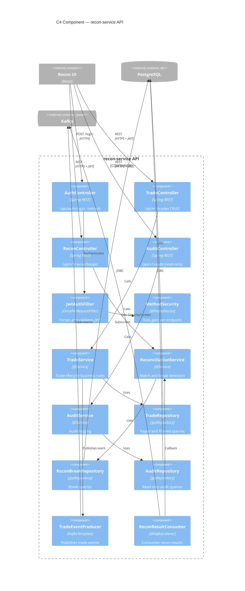

# C4 Component — recon-service API

```mermaid
C4Component
title C4 Component — recon-service API

Container_Ext(reactSpa, "Recon UI", "React")
ContainerDb_Ext(postgres, "PostgreSQL")
ContainerQueue_Ext(kafka, "Kafka")

Container_Boundary(api, "recon-service API") {

    Component(authCtl, "AuthController", "Spring REST", "/api/auth/login, /refresh")
    Component(tradeCtl, "TradeController", "Spring REST", "/api/v1/trades CRUD")
    Component(reconCtl, "ReconController", "Spring REST", "/api/v1/recon/breaks")
    Component(auditCtl, "AuditController", "Spring REST", "/api/v1/audit (read-only)")

    Component(jwtFilter, "JwtAuthFilter", "OncePerRequestFilter", "Parses and validates JWT")
    Component(rbac, "MethodSecurity", "@PreAuthorize", "Role gate per endpoint")

    Component(tradeSvc, "TradeService", "@Service", "Trade lifecycle business rules")
    Component(reconSvc, "ReconciliationService", "@Service", "Match and break detection")
    Component(auditSvc, "AuditService", "@Service", "Audit logging")

    Component(tradeRepo, "TradeRepository", "JpaRepository", "Paged and filtered queries")
    Component(reconRepo, "ReconBreakRepository", "JpaRepository", "Break queries")
    Component(auditRepo, "AuditRepository", "JpaRepository", "Read-only audit queries")

    Component(producer, "TradeEventProducer", "KafkaTemplate", "Publishes trade-events")
    Component(consumer, "ReconResultConsumer", "@KafkaListener", "Consumes recon-results")
}

Rel(reactSpa, authCtl, "POST /login", "HTTPS")
Rel(reactSpa, tradeCtl, "REST", "HTTPS + JWT")
Rel(reactSpa, reconCtl, "REST", "HTTPS + JWT")
Rel(reactSpa, auditCtl, "REST", "HTTPS + JWT")

Rel(authCtl, jwtFilter, "Authenticates")
Rel(jwtFilter, rbac, "Sets SecurityContext")

Rel(tradeCtl, tradeSvc, "Calls")
Rel(reconCtl, reconSvc, "Calls")
Rel(auditCtl, auditSvc, "Calls")

Rel(tradeSvc, tradeRepo, "Uses")
Rel(reconSvc, reconRepo, "Uses")
Rel(auditSvc, auditRepo, "Uses")

Rel(tradeRepo, postgres, "JDBC")
Rel(reconRepo, postgres, "JDBC")
Rel(auditRepo, postgres, "JDBC")

Rel(tradeSvc, producer, "Publishes event")
Rel(producer, kafka, "Trade events")

Rel(consumer, kafka, "Subscribes")
Rel(consumer, reconSvc, "Callback")
```