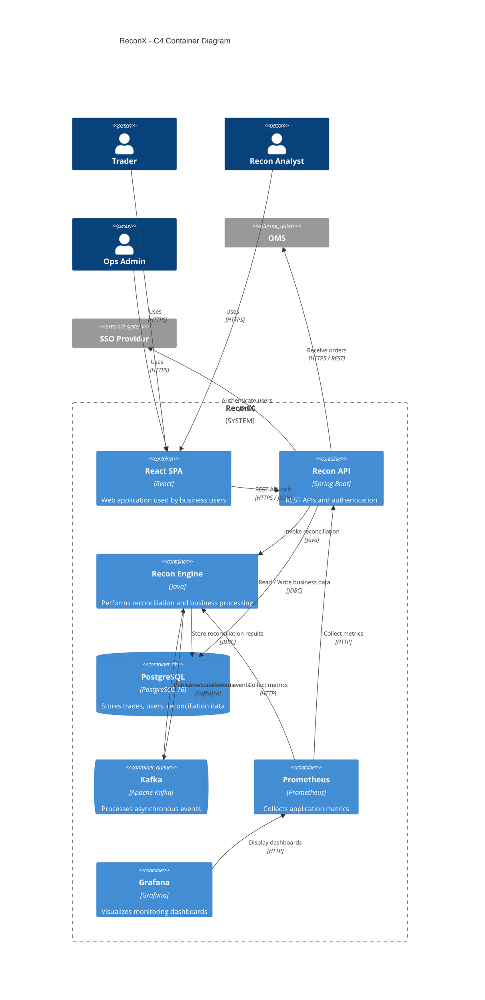

# C4 Container Diagram - ReconX

```mermaid
C4Container
title ReconX - C4 Container Diagram

Person(trader, "Trader")
Person(reconAnalyst, "Recon Analyst")
Person(opsAdmin, "Ops Admin")

System_Ext(oms, "OMS")
System_Ext(sso, "SSO Provider")

System_Boundary(reconxBoundary, "ReconX") {

    Container(web, "React SPA", "React", "Web application used by business users")

    Container(api, "Recon API", "Spring Boot", "REST APIs and authentication")

    Container(engine, "Recon Engine", "Java", "Performs reconciliation and business processing")

    ContainerDb(db, "PostgreSQL", "PostgreSQL 16", "Stores trades, users, reconciliation data")

    ContainerQueue(kafka, "Kafka", "Apache Kafka", "Processes asynchronous events")

    Container(prometheus, "Prometheus", "Prometheus", "Collects application metrics")

    Container(grafana, "Grafana", "Grafana", "Visualizes monitoring dashboards")
}

Rel(trader, web, "Uses", "HTTPS")
Rel(reconAnalyst, web, "Uses", "HTTPS")
Rel(opsAdmin, web, "Uses", "HTTPS")

Rel(web, api, "REST API calls", "HTTPS / JSON")

Rel(api, engine, "Invoke reconciliation", "Java")
Rel(api, db, "Read / Write business data", "JDBC")
Rel(engine, db, "Store reconciliation results", "JDBC")
Rel(engine, kafka, "Publish reconciliation events", "Kafka")
Rel(kafka, engine, "Consume trade events", "Kafka")

Rel(api, sso, "Authenticate users", "OIDC")
Rel(api, oms, "Receive orders", "HTTPS / REST")

Rel(prometheus, api, "Collect metrics", "HTTP")
Rel(prometheus, engine, "Collect metrics", "HTTP")
Rel(grafana, prometheus, "Display dashboards", "HTTP")
```