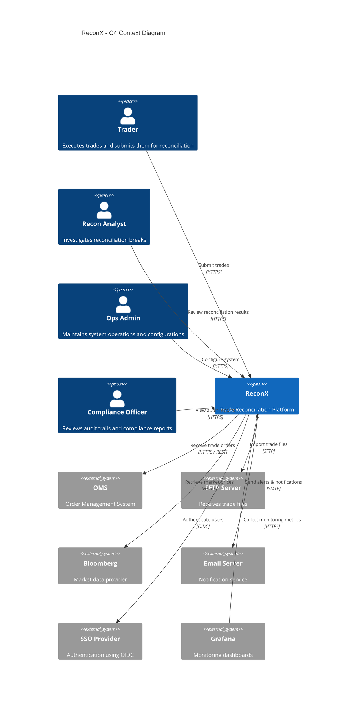

# C4 Context Diagram - ReconX

```mermaid
C4Context
title ReconX - C4 Context Diagram

Person(trader, "Trader", "Executes trades and submits them for reconciliation")
Person(reconAnalyst, "Recon Analyst", "Investigates reconciliation breaks")
Person(opsAdmin, "Ops Admin", "Maintains system operations and configurations")
Person(compliance, "Compliance Officer", "Reviews audit trails and compliance reports")

System(reconx, "ReconX", "Trade Reconciliation Platform")

System_Ext(oms, "OMS", "Order Management System")
System_Ext(sftp, "SFTP Server", "Receives trade files")
System_Ext(bloomberg, "Bloomberg", "Market data provider")
System_Ext(email, "Email Server", "Notification service")
System_Ext(sso, "SSO Provider", "Authentication using OIDC")
System_Ext(grafana, "Grafana", "Monitoring dashboards")

Rel(trader, reconx, "Submit trades", "HTTPS")
Rel(reconAnalyst, reconx, "Review reconciliation results", "HTTPS")
Rel(opsAdmin, reconx, "Configure system", "HTTPS")
Rel(compliance, reconx, "View audit reports", "HTTPS")

Rel(reconx, oms, "Receive trade orders", "HTTPS / REST")
Rel(reconx, sftp, "Import trade files", "SFTP")
Rel(reconx, bloomberg, "Retrieve market prices", "HTTPS")
Rel(reconx, email, "Send alerts & notifications", "SMTP")
Rel(reconx, sso, "Authenticate users", "OIDC")
Rel(grafana, reconx, "Collect monitoring metrics", "HTTPS")
```